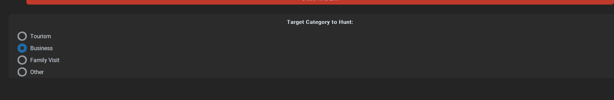

# tracking process
i want boot to keep listening to `Target Category To Hunt` while its running also ..

select from `Choose your sub-category` what user selected in `Target Category To Hunt` ..read alert div
if alert div is    `We are sorry but no appointment slots are currently available. New slots open at regular intervals, please try again later`
we start 2 switch process
## switch process
so its randomly switch between 4 option like 1 , 4 , 2 , 3 and between each one of those 1 , 4, 2, 3 wait do
human_delay(1, 5)
until it find  `available slots` in the the option that user chose ..press continue button ..the call function alert+user
wait for 3 ~ 5 mints then start new switch process 
if after switching process still `no appointment slots` should call function def log_out
so you have to change function `fill_appointment_form():` in order to that functionality ..after fuilling
to fill `Choose your Application Centre*` and `Choose your appointment category*`
then call tracking function to do that tracking porecess we mentioned earlier
# logout section 
```html
<div aria-labelledby="navbarDropdown" class="dropdown-menu dropdown-menu-right mb-15 cursor-pointer show" data-bs-popper="static"><a tabindex="0" class="dropdown-item">Dashboard</a><div class="dropdown-divider"></div><a tabindex="0" class="dropdown-item bg-brand-orange text-white cursor-pointer c-inherit"> Logout </a></div>
```
```html
<a href="#" id="navbarDropdown" role="button" data-bs-toggle="dropdown" aria-haspopup="true" aria-expanded="true" class="nav-link dropdown-toggle c-brand-orange show"> My Account </a>
```
```html
<a tabindex="0" class="dropdown-item bg-brand-orange text-white cursor-pointer c-inherit"> Logout </a>
```
# rest of elements

```
```html
<mat-card class="mat-mdc-card mdc-card form-card"
  ><p class="grey-color mb-5">All fields are mandatory</p>
  <h1 class="fs-24 fs-sm-46 mb-25">Appointment Details</h1>
  <p class="c-brand-grey-para mb-15">
    Please provide information about the type of visa you wish to apply for. Be
    aware that the appointment category Applicant 1 chooses will be applied to
    each of the applicants added to your appointment booking.
  </p>
  <!---->
  <form novalidate="" class="ng-touched ng-dirty ng-valid">
    <!----><!---->
    <div class="form-group">
      <div class="mt-15">
        <label for="mat-select-0" id="mat-select-value-1" class="align-label"
          ><div>
            Choose your Application Centre<span class="c-brand-error">*</span
            ><!---->
          </div>
          <p class="d-inline float-end text-end">1 Centre(s)</p>
          <!----></label
        >
      </div>
      <!----><mat-form-field
        aria-describedby="errorMsg"
        appearance="outline"
        class="mat-mdc-form-field mat-form-field-outline-brand mat-mdc-form-field-type-mat-select mat-form-field-appearance-outline mat-primary ng-untouched ng-pristine mat-form-field-animations-enabled ng-valid"
        ><!---->
        <div
          class="mat-mdc-text-field-wrapper mdc-text-field mdc-text-field--outlined mdc-text-field--no-label"
        >
          <!---->
          <div tclass="mat-mdc-form-field-flex">
            <div
              matformfieldnotchedoutline=""
              class="mdc-notched-outline mdc-notched-outline--no-label"
            >
              <div
                class="mat-mdc-notch-piece mdc-notched-outline__leading"
              ></div>
              <div class="mat-mdc-notch-piece mdc-notched-outline__notch">
                <!----><!----><!---->
              </div>
              <div
                class="mat-mdc-notch-piece mdc-notched-outline__trailing"
              ></div>
            </div>
            <!----><!----><!---->
            <div class="mat-mdc-form-field-infix">
              <!----><mat-select
                role="combobox"
                aria-haspopup="listbox"
                formcontrolname="centerCode"
                appdefaultselect=""
                class="mat-mdc-select mat-mdc-select-required ng-untouched ng-pristine ng-valid"
                aria-labelledby="mat-select-value-0"
                id="mat-select-0"
                tabindex="0"
                aria-expanded="false"
                aria-required="true"
                aria-disabled="false"
                aria-invalid="false"
                aria-activedescendant="NLD-NCNC"
                ><div cdk-overlay-origin="" class="mat-mdc-select-trigger">
                  <div class="mat-mdc-select-value" id="mat-select-value-0">
                    <!----><span class="mat-mdc-select-value-text"
                      ><!----><span class="mat-mdc-select-min-line"
                        >The Netherlands Visa Application Centre, Cairo</span
                      ><!----></span
                    ><!---->
                  </div>
                  <div class="mat-mdc-select-arrow-wrapper">
                    <div class="mat-mdc-select-arrow">
                      <svg
                        viewBox="0 0 24 24"
                        width="24px"
                        height="24px"
                        focusable="false"
                        aria-hidden="true"
                      >
                        <path d="M7 10l5 5 5-5z"></path>
                      </svg>
                    </div>
                  </div>
                </div>
                <!----></mat-select
              >
            </div>
            <!----><!---->
          </div>
          <!---->
        </div>
        <div
          class="mat-mdc-form-field-subscript-wrapper mat-mdc-form-field-bottom-align"
        >
          <div
            aria-atomic="true"
            aria-live="polite"
            class="mat-mdc-form-field-hint-wrapper"
          >
            <!----><!---->
            <div class="mat-mdc-form-field-hint-spacer"></div>
            <!---->
          </div>
        </div></mat-form-field
      >
    </div>
    <hr role="presentation" />
    <!----><!---->
    <div class="form-group">
      <label for="mat-select-4" id="mat-select-value-5">
        Choose your appointment category<span class="c-brand-error">*</span
        ><!----></label
      ><!----><mat-form-field
        aria-describedby="errorMsg"
        appearance="outline"
        class="mat-mdc-form-field mat-form-field-outline-brand mat-mdc-form-field-type-mat-select mat-form-field-appearance-outline mat-primary ng-untouched ng-pristine mat-form-field-animations-enabled ng-valid"
        ><!---->
        <div
          class="mat-mdc-text-field-wrapper mdc-text-field mdc-text-field--outlined mdc-text-field--no-label"
        >
          <!---->
          <div class="mat-mdc-form-field-flex">
            <div
              matformfieldnotchedoutline=""
              class="mdc-notched-outline mdc-notched-outline--no-label"
            >
              <div
                class="mat-mdc-notch-piece mdc-notched-outline__leading"
              ></div>
              <div class="mat-mdc-notch-piece mdc-notched-outline__notch">
                <!----><!----><!---->
              </div>
              <div
                class="mat-mdc-notch-piece mdc-notched-outline__trailing"
              ></div>
            </div>
            <!----><!----><!---->
            <div class="mat-mdc-form-field-infix">
              <!----><mat-select
                role="combobox"
                aria-haspopup="listbox"
                formcontrolname="selectedSubvisaCategory"
                appdefaultselect=""
                class="mat-mdc-select mat-mdc-select-required ng-untouched ng-pristine ng-valid"
                aria-labelledby="mat-select-value-2"
                id="mat-select-2"
                tabindex="0"
                aria-expanded="false"
                aria-required="true"
                aria-disabled="false"
                aria-invalid="false"
                aria-activedescendant="Short Stay"
                ><div cdk-overlay-origin="" class="mat-mdc-select-trigger">
                  <div class="mat-mdc-select-value" id="mat-select-value-2">
                    <!----><span class="mat-mdc-select-value-text"
                      ><!----><span class="mat-mdc-select-min-line"
                        >Short Stay Visa - Type C</span
                      ><!----></span
                    ><!---->
                  </div>
                  <div class="mat-mdc-select-arrow-wrapper">
                    <div class="mat-mdc-select-arrow">
                      <svg
                        viewBox="0 0 24 24"
                        width="24px"
                        height="24px"
                        focusable="false"
                        aria-hidden="true"
                      >
                        <path d="M7 10l5 5 5-5z"></path>
                      </svg>
                    </div>
                  </div>
                </div>
                <!----></mat-select
              >
            </div>
            <!----><!---->
          </div>
          <!---->
        </div>
        <div
          class="mat-mdc-form-field-subscript-wrapper mat-mdc-form-field-bottom-align"
        >
          <div
            aria-atomic="true"
            aria-live="polite"
            class="mat-mdc-form-field-hint-wrapper"
          >
            <!----><!---->
            <div class="mat-mdc-form-field-hint-spacer"></div>
            <!---->
          </div>
        </div></mat-form-field
      >
    </div>
    <!---->
    <hr role="presentation" />
    <!----><!----><!---->
    <div class="form-group">
      <label for="mat-select-2" id="mat-select-value-3">
        Choose your sub-category<span class="c-brand-error">*</span
        ><!----><!----></label
      ><!----><mat-form-field
        aria-describedby="errorMsg"
        appearance="outline"
        class="mat-mdc-form-field mat-form-field-outline-brand mat-mdc-form-field-type-mat-select mat-form-field-appearance-outline mat-primary mat-form-field-animations-enabled ng-touched ng-dirty ng-valid"
        ><!---->
        <div
          class="mat-mdc-text-field-wrapper mdc-text-field mdc-text-field--outlined mdc-text-field--no-label"
        >
          <!---->
          <div class="mat-mdc-form-field-flex">
            <div
              matformfieldnotchedoutline=""
              class="mdc-notched-outline mdc-notched-outline--no-label"
            >
              <div
                class="mat-mdc-notch-piece mdc-notched-outline__leading"
              ></div>
              <div class="mat-mdc-notch-piece mdc-notched-outline__notch">
                <!----><!----><!---->
              </div>
              <div
                class="mat-mdc-notch-piece mdc-notched-outline__trailing"
              ></div>
            </div>
            <!----><!----><!---->
            <div class="mat-mdc-form-field-infix">
              <!----><mat-select
                role="combobox"
                aria-haspopup="listbox"
                formcontrolname="visaCategoryCode"
                appdefaultselect=""
                mattooltipposition="above"
                mattooltipclass="mat-tooltip-full"
                class="mat-mdc-select mat-mdc-tooltip-trigger mat-mdc-select-required ng-touched ng-dirty ng-valid"
                aria-labelledby="mat-select-value-1"
                id="mat-select-1"
                tabindex="0"
                aria-expanded="false"
                aria-required="true"
                aria-disabled="false"
                aria-invalid="false"
                ><div cdk-overlay-origin="" class="mat-mdc-select-trigger">
                  <div class="mat-mdc-select-value" id="mat-select-value-1">
                    <!----><span class="mat-mdc-select-value-text"
                      ><!----><span class="mat-mdc-select-min-line"
                        >Tourism</span
                      ><!----></span
                    ><!---->
                  </div>
                  <div class="mat-mdc-select-arrow-wrapper">
                    <div class="mat-mdc-select-arrow">
                      <svg
                        viewBox="0 0 24 24"
                        width="24px"
                        height="24px"
                        focusable="false"
                        aria-hidden="true"
                      >
                        <path d="M7 10l5 5 5-5z"></path>
                      </svg>
                    </div>
                  </div>
                </div>
                <!----></mat-select
              ><!---->
            </div>
            <!----><!---->
          </div>
          <!---->
        </div>
        <div
          class="mat-mdc-form-field-subscript-wrapper mat-mdc-form-field-bottom-align"
        >
          <div
            aria-atomic="true"
            aria-live="polite"
            class="mat-mdc-form-field-hint-wrapper"
          >
            <!----><!---->
            <div class="mat-mdc-form-field-hint-spacer"></div>
            <!---->
          </div>
        </div></mat-form-field
      >
    </div>
    <hr role="presentation" />
    <!----><!----><!----><!----><!----><!----><!----><!----><!----><!----><!----><!----><!---->
    <div class="mb-0 Information">
      <div role="alert" class="alert border-0 rounded-0">
        We are sorry but no appointment slots are currently available. New slots
        open at regular intervals, please try again later
      </div>
    </div>
    <!----><!----><!---->
  </form></mat-card
>
```

```html

<form novalidate="" class="ng-touched ng-dirty ng-valid"><!----><!----><div class="form-group"><div class="mt-15"><label for="mat-select-0" id="mat-select-value-1" class="align-label"><div> Choose your Application Centre<span class="c-brand-error">*</span><!----></div><p class="d-inline float-end text-end"> 1 Centre(s) </p><!----></label></div><!----><mat-form-field aria-describedby="errorMsg" appearance="outline" class="mat-mdc-form-field mat-form-field-outline-brand mat-mdc-form-field-type-mat-select mat-form-field-appearance-outline mat-primary ng-untouched ng-pristine mat-form-field-animations-enabled ng-valid"><!----><div class="mat-mdc-text-field-wrapper mdc-text-field mdc-text-field--outlined mdc-text-field--no-label"><!----><div class="mat-mdc-form-field-flex"><div matformfieldnotchedoutline="" class="mdc-notched-outline mdc-notched-outline--no-label"><div class="mat-mdc-notch-piece mdc-notched-outline__leading"></div><div class="mat-mdc-notch-piece mdc-notched-outline__notch"><!----><!----><!----></div><div class="mat-mdc-notch-piece mdc-notched-outline__trailing"></div></div><!----><!----><!----><div class="mat-mdc-form-field-infix"><!----><mat-select role="combobox" aria-haspopup="listbox" formcontrolname="centerCode" appdefaultselect="" class="mat-mdc-select mat-mdc-select-required ng-untouched ng-pristine ng-valid" aria-labelledby="mat-select-value-0" id="mat-select-0" tabindex="0" aria-expanded="false" aria-required="true" aria-disabled="false" aria-invalid="false" aria-activedescendant="NLD-NCNC"><div cdk-overlay-origin="" class="mat-mdc-select-trigger"><div class="mat-mdc-select-value" id="mat-select-value-0"><!----><span class="mat-mdc-select-value-text"><!----><span class="mat-mdc-select-min-line">The Netherlands Visa Application Centre, Cairo</span><!----></span><!----></div><div class="mat-mdc-select-arrow-wrapper"><div class="mat-mdc-select-arrow"><svg viewBox="0 0 24 24" width="24px" height="24px" focusable="false" aria-hidden="true"><path d="M7 10l5 5 5-5z"></path></svg></div></div></div><!----></mat-select></div><!----><!----></div><!----></div><div class="mat-mdc-form-field-subscript-wrapper mat-mdc-form-field-bottom-align"><div aria-atomic="true" aria-live="polite" class="mat-mdc-form-field-hint-wrapper"><!----><!----><div class="mat-mdc-form-field-hint-spacer"></div><!----></div></div></mat-form-field></div><hr role="presentation"><!----><!----><div class="form-group"><label for="mat-select-4" id="mat-select-value-5"> Choose your appointment category<span class="c-brand-error">*</span><!----></label><!----><mat-form-field aria-describedby="errorMsg" appearance="outline" class="mat-mdc-form-field mat-form-field-outline-brand mat-mdc-form-field-type-mat-select mat-form-field-appearance-outline mat-primary ng-untouched ng-pristine mat-form-field-animations-enabled ng-valid"><!----><div class="mat-mdc-text-field-wrapper mdc-text-field mdc-text-field--outlined mdc-text-field--no-label"><!----><div class="mat-mdc-form-field-flex"><div matformfieldnotchedoutline="" class="mdc-notched-outline mdc-notched-outline--no-label"><div class="mat-mdc-notch-piece mdc-notched-outline__leading"></div><div class="mat-mdc-notch-piece mdc-notched-outline__notch"><!----><!----><!----></div><div class="mat-mdc-notch-piece mdc-notched-outline__trailing"></div></div><!----><!----><!----><div class="mat-mdc-form-field-infix"><!----><mat-select role="combobox" aria-haspopup="listbox" formcontrolname="selectedSubvisaCategory" appdefaultselect="" class="mat-mdc-select mat-mdc-select-required ng-untouched ng-pristine ng-valid" aria-labelledby="mat-select-value-2" id="mat-select-2" tabindex="0" aria-expanded="false" aria-required="true" aria-disabled="false" aria-invalid="false" aria-activedescendant="Short Stay"><div cdk-overlay-origin="" class="mat-mdc-select-trigger"><div class="mat-mdc-select-value" id="mat-select-value-2"><!----><span class="mat-mdc-select-value-text"><!----><span class="mat-mdc-select-min-line">Short Stay Visa - Type C</span><!----></span><!----></div><div class="mat-mdc-select-arrow-wrapper"><div class="mat-mdc-select-arrow"><svg viewBox="0 0 24 24" width="24px" height="24px" focusable="false" aria-hidden="true"><path d="M7 10l5 5 5-5z"></path></svg></div></div></div><!----></mat-select></div><!----><!----></div><!----></div><div class="mat-mdc-form-field-subscript-wrapper mat-mdc-form-field-bottom-align"><div aria-atomic="true" aria-live="polite" class="mat-mdc-form-field-hint-wrapper"><!----><!----><div class="mat-mdc-form-field-hint-spacer"></div><!----></div></div></mat-form-field></div><!----><hr role="presentation"><!----><!----><!----><div class="form-group"><label for="mat-select-2" id="mat-select-value-3"> Choose your sub-category<span class="c-brand-error">*</span><!----><!----></label><!----><mat-form-field aria-describedby="errorMsg" appearance="outline" class="mat-mdc-form-field mat-form-field-outline-brand mat-mdc-form-field-type-mat-select mat-form-field-appearance-outline mat-primary mat-form-field-animations-enabled ng-touched ng-dirty ng-valid"><!----><div class="mat-mdc-text-field-wrapper mdc-text-field mdc-text-field--outlined mdc-text-field--no-label"><!----><div class="mat-mdc-form-field-flex"><div matformfieldnotchedoutline="" class="mdc-notched-outline mdc-notched-outline--no-label"><div class="mat-mdc-notch-piece mdc-notched-outline__leading"></div><div class="mat-mdc-notch-piece mdc-notched-outline__notch"><!----><!----><!----></div><div class="mat-mdc-notch-piece mdc-notched-outline__trailing"></div></div><!----><!----><!----><div class="mat-mdc-form-field-infix"><!----><mat-select role="combobox" aria-haspopup="listbox" formcontrolname="visaCategoryCode" appdefaultselect="" mattooltipposition="above" mattooltipclass="mat-tooltip-full" class="mat-mdc-select mat-mdc-tooltip-trigger mat-mdc-select-required ng-touched ng-dirty ng-valid" aria-labelledby="mat-select-value-1" id="mat-select-1" tabindex="0" aria-expanded="false" aria-required="true" aria-disabled="false" aria-invalid="false"><div cdk-overlay-origin="" class="mat-mdc-select-trigger"><div class="mat-mdc-select-value" id="mat-select-value-1"><!----><span class="mat-mdc-select-value-text"><!----><span class="mat-mdc-select-min-line">Family/Friend Visit</span><!----></span><!----></div><div class="mat-mdc-select-arrow-wrapper"><div class="mat-mdc-select-arrow"><svg viewBox="0 0 24 24" width="24px" height="24px" focusable="false" aria-hidden="true"><path d="M7 10l5 5 5-5z"></path></svg></div></div></div><!----></mat-select><!----></div><!----><!----></div><!----></div><div class="mat-mdc-form-field-subscript-wrapper mat-mdc-form-field-bottom-align"><div aria-atomic="true" aria-live="polite" class="mat-mdc-form-field-hint-wrapper"><!----><!----><div class="mat-mdc-form-field-hint-spacer"></div><!----></div></div></mat-form-field></div><hr role="presentation"><!----><!----><!----><!----><!----><!----><!----><!----><!----><!----><!----><!----><!----><!----><div class="mb-0"><div role="alert" class="Information alert mt-5 mb-20 border-0 rounded-0 form-info"> Earliest available slot for 1 Applicants is : 11-05-2026 </div><div role="alert" class="Information alert mt-5 mb-20 border-0 rounded-0 form-info"> Earliest available slot for 2,3,4 Applicants is : 12-05-2026 </div><!----

></div><!----><!----></form>

```

```html
<mat-card class="mat-mdc-card mdc-card form-card"
  ><p class="grey-color mb-5">All fields are mandatory</p>
  <h1 class="fs-24 fs-sm-46 mb-25">Appointment Details</h1>
  <p class="c-brand-grey-para mb-15">
    Please provide information about the type of visa you wish to apply for. Be
    aware that the appointment category Applicant 1 chooses will be applied to
    each of the applicants added to your appointment booking.
  </p>
  <!---->
  <form novalidate="" class="ng-touched ng-dirty ng-valid">
    <!----><!---->
    <div class="form-group">
      <div class="mt-15">
        <label for="mat-select-0" id="mat-select-value-1" class="align-label"
          ><div>
            Choose your Application Centre<span class="c-brand-error">*</span
            ><!---->
          </div>
          <p class="d-inline float-end text-end">1 Centre(s)</p>
          <!----></label
        >
      </div>
      <!----><mat-form-field
        aria-describedby="errorMsg"
        appearance="outline"
        class="mat-mdc-form-field mat-form-field-outline-brand mat-mdc-form-field-type-mat-select mat-form-field-appearance-outline mat-primary ng-untouched ng-pristine mat-form-field-animations-enabled ng-valid"
        ><!---->
        <div
          class="mat-mdc-text-field-wrapper mdc-text-field mdc-text-field--outlined mdc-text-field--no-label"
        >
          <!---->
          <div class="mat-mdc-form-field-flex">
            <div
              matformfieldnotchedoutline=""
              class="mdc-notched-outline mdc-notched-outline--no-label"
            >
              <div
                class="mat-mdc-notch-piece mdc-notched-outline__leading"
              ></div>
              <div class="mat-mdc-notch-piece mdc-notched-outline__notch">
                <!----><!----><!---->
              </div>
              <div
                class="mat-mdc-notch-piece mdc-notched-outline__trailing"
              ></div>
            </div>
            <!----><!----><!---->
            <div class="mat-mdc-form-field-infix">
              <!----><mat-select
                role="combobox"
                aria-haspopup="listbox"
                formcontrolname="centerCode"
                appdefaultselect=""
                class="mat-mdc-select mat-mdc-select-required ng-untouched ng-pristine ng-valid"
                aria-labelledby="mat-select-value-0"
                id="mat-select-0"
                tabindex="0"
                aria-expanded="false"
                aria-required="true"
                aria-disabled="false"
                aria-invalid="false"
                aria-activedescendant="NLD-NCNC"
                ><div cdk-overlay-origin="" class="mat-mdc-select-trigger">
                  <div class="mat-mdc-select-value" id="mat-select-value-0">
                    <!----><span class="mat-mdc-select-value-text"
                      ><!----><span class="mat-mdc-select-min-line"
                        >The Netherlands Visa Application Centre, Cairo</span
                      ><!----></span
                    ><!---->
                  </div>
                  <div class="mat-mdc-select-arrow-wrapper">
                    <div class="mat-mdc-select-arrow">
                      <svg
                        viewBox="0 0 24 24"
                        width="24px"
                        height="24px"
                        focusable="false"
                        aria-hidden="true"
                      >
                        <path d="M7 10l5 5 5-5z"></path>
                      </svg>
                    </div>
                  </div>
                </div>
                <!----></mat-select
              >
            </div>
            <!----><!---->
          </div>
          <!---->
        </div>
        <div
          class="mat-mdc-form-field-subscript-wrapper mat-mdc-form-field-bottom-align"
        >
          <div
            aria-atomic="true"
            aria-live="polite"
            class="mat-mdc-form-field-hint-wrapper"
          >
            <!----><!---->
            <div class="mat-mdc-form-field-hint-spacer"></div>
            <!---->
          </div>
        </div></mat-form-field
      >
    </div>
    <hr role="presentation" />
    <!----><!---->
    <div class="form-group">
      <label for="mat-select-4" id="mat-select-value-5">
        Choose your appointment category<span class="c-brand-error">*</span
        ><!----></label
      ><!----><mat-form-field
        aria-describedby="errorMsg"
        appearance="outline"
        class="mat-mdc-form-field mat-form-field-outline-brand mat-mdc-form-field-type-mat-select mat-form-field-appearance-outline mat-primary ng-untouched ng-pristine mat-form-field-animations-enabled ng-valid"
        ><!---->
        <div
          class="mat-mdc-text-field-wrapper mdc-text-field mdc-text-field--outlined mdc-text-field--no-label"
        >
          <!---->
          <div class="mat-mdc-form-field-flex">
            <div
              matformfieldnotchedoutline=""
              class="mdc-notched-outline mdc-notched-outline--no-label"
            >
              <div
                class="mat-mdc-notch-piece mdc-notched-outline__leading"
              ></div>
              <div class="mat-mdc-notch-piece mdc-notched-outline__notch">
                <!----><!----><!---->
              </div>
              <div
                class="mat-mdc-notch-piece mdc-notched-outline__trailing"
              ></div>
            </div>
            <!----><!----><!---->
            <div class="mat-mdc-form-field-infix">
              <!----><mat-select
                role="combobox"
                aria-haspopup="listbox"
                formcontrolname="selectedSubvisaCategory"
                appdefaultselect=""
                class="mat-mdc-select mat-mdc-select-required ng-untouched ng-pristine ng-valid"
                aria-labelledby="mat-select-value-2"
                id="mat-select-2"
                tabindex="0"
                aria-expanded="false"
                aria-required="true"
                aria-disabled="false"
                aria-invalid="false"
                aria-activedescendant="Short Stay"
                ><div cdk-overlay-origin="" class="mat-mdc-select-trigger">
                  <div class="mat-mdc-select-value" id="mat-select-value-2">
                    <!----><span class="mat-mdc-select-value-text"
                      ><!----><span class="mat-mdc-select-min-line"
                        >Short Stay Visa - Type C</span
                      ><!----></span
                    ><!---->
                  </div>
                  <div class="mat-mdc-select-arrow-wrapper">
                    <div class="mat-mdc-select-arrow">
                      <svg
                        viewBox="0 0 24 24"
                        width="24px"
                        height="24px"
                        focusable="false"
                        aria-hidden="true"
                      >
                        <path d="M7 10l5 5 5-5z"></path>
                      </svg>
                    </div>
                  </div>
                </div>
                <!----></mat-select
              >
            </div>
            <!----><!---->
          </div>
          <!---->
        </div>
        <div
          class="mat-mdc-form-field-subscript-wrapper mat-mdc-form-field-bottom-align"
        >
          <div
            aria-atomic="true"
            aria-live="polite"
            class="mat-mdc-form-field-hint-wrapper"
          >
            <!----><!---->
            <div class="mat-mdc-form-field-hint-spacer"></div>
            <!---->
          </div>
        </div></mat-form-field
      >
    </div>
    <!---->
    <hr role="presentation" />
    <!----><!----><!---->
    <div class="form-group">
      <label for="mat-select-2" id="mat-select-value-3">
        Choose your sub-category<span class="c-brand-error">*</span
        ><!----><!----></label
      ><!----><mat-form-field
        aria-describedby="errorMsg"
        appearance="outline"
        class="mat-mdc-form-field mat-form-field-outline-brand mat-mdc-form-field-type-mat-select mat-form-field-appearance-outline mat-primary mat-form-field-animations-enabled ng-touched ng-dirty ng-valid"
        ><!---->
        <div
          class="mat-mdc-text-field-wrapper mdc-text-field mdc-text-field--outlined mdc-text-field--no-label"
        >
          <!---->
          <div class="mat-mdc-form-field-flex">
            <div
              matformfieldnotchedoutline=""
              class="mdc-notched-outline mdc-notched-outline--no-label"
            >
              <div
                class="mat-mdc-notch-piece mdc-notched-outline__leading"
              ></div>
              <div class="mat-mdc-notch-piece mdc-notched-outline__notch">
                <!----><!----><!---->
              </div>
              <div
                class="mat-mdc-notch-piece mdc-notched-outline__trailing"
              ></div>
            </div>
            <!----><!----><!---->
            <div class="mat-mdc-form-field-infix">
              <!----><mat-select
                role="combobox"
                aria-haspopup="listbox"
                formcontrolname="visaCategoryCode"
                appdefaultselect=""
                mattooltipposition="above"
                mattooltipclass="mat-tooltip-full"
                class="mat-mdc-select mat-mdc-tooltip-trigger mat-mdc-select-required ng-touched ng-dirty ng-valid"
                aria-labelledby="mat-select-value-1"
                id="mat-select-1"
                tabindex="0"
                aria-expanded="false"
                aria-required="true"
                aria-disabled="false"
                aria-invalid="false"
                ><div cdk-overlay-origin="" class="mat-mdc-select-trigger">
                  <div class="mat-mdc-select-value" id="mat-select-value-1">
                    <!----><span class="mat-mdc-select-value-text"
                      ><!----><span class="mat-mdc-select-min-line"
                        >Tourism</span
                      ><!----></span
                    ><!---->
                  </div>
                  <div class="mat-mdc-select-arrow-wrapper">
                    <div class="mat-mdc-select-arrow">
                      <svg
                        viewBox="0 0 24 24"
                        width="24px"
                        height="24px"
                        focusable="false"
                        aria-hidden="true"
                      >
                        <path d="M7 10l5 5 5-5z"></path>
                      </svg>
                    </div>
                  </div>
                </div>
                <!----></mat-select
              ><!---->
            </div>
            <!----><!---->
          </div>
          <!---->
        </div>
        <div
          class="mat-mdc-form-field-subscript-wrapper mat-mdc-form-field-bottom-align"
        >
          <div
            aria-atomic="true"
            aria-live="polite"
            class="mat-mdc-form-field-hint-wrapper"
          >
            <!----><!---->
            <div class="mat-mdc-form-field-hint-spacer"></div>
            <!---->
          </div>
        </div></mat-form-field
      >
    </div>
    <hr role="presentation" />
    <!----><!----><!----><!----><!----><!----><!----><!----><!----><!----><!----><!----><!---->
    <div class="mb-0 Information">
      <div role="alert" class="alert border-0 rounded-0">
        We are sorry but no appointment slots are currently available. New slots
        open at regular intervals, please try again later
      </div>
    </div>
    <!----><!----><!---->
  </form></mat-card
>
```

```html

<form novalidate="" class="ng-touched ng-dirty ng-valid"><!----><!----><div class="form-group"><div class="mt-15"><label for="mat-select-0" id="mat-select-value-1" class="align-label"><div> Choose your Application Centre<span class="c-brand-error">*</span><!----></div><p class="d-inline float-end text-end"> 1 Centre(s) </p><!----></label></div><!----><mat-form-field aria-describedby="errorMsg" appearance="outline" class="mat-mdc-form-field mat-form-field-outline-brand mat-mdc-form-field-type-mat-select mat-form-field-appearance-outline mat-primary ng-untouched ng-pristine mat-form-field-animations-enabled ng-valid"><!----><div class="mat-mdc-text-field-wrapper mdc-text-field mdc-text-field--outlined mdc-text-field--no-label"><!----><div class="mat-mdc-form-field-flex"><div matformfieldnotchedoutline="" class="mdc-notched-outline mdc-notched-outline--no-label"><div class="mat-mdc-notch-piece mdc-notched-outline__leading"></div><div class="mat-mdc-notch-piece mdc-notched-outline__notch"><!----><!----><!----></div><div class="mat-mdc-notch-piece mdc-notched-outline__trailing"></div></div><!----><!----><!----><div class="mat-mdc-form-field-infix"><!----><mat-select role="combobox" aria-haspopup="listbox" formcontrolname="centerCode" appdefaultselect="" class="mat-mdc-select mat-mdc-select-required ng-untouched ng-pristine ng-valid" aria-labelledby="mat-select-value-0" id="mat-select-0" tabindex="0" aria-expanded="false" aria-required="true" aria-disabled="false" aria-invalid="false" aria-activedescendant="NLD-NCNC"><div cdk-overlay-origin="" class="mat-mdc-select-trigger"><div class="mat-mdc-select-value" id="mat-select-value-0"><!----><span class="mat-mdc-select-value-text"><!----><span class="mat-mdc-select-min-line">The Netherlands Visa Application Centre, Cairo</span><!----></span><!----></div><div class="mat-mdc-select-arrow-wrapper"><div class="mat-mdc-select-arrow"><svg viewBox="0 0 24 24" width="24px" height="24px" focusable="false" aria-hidden="true"><path d="M7 10l5 5 5-5z"></path></svg></div></div></div><!----></mat-select></div><!----><!----></div><!----></div><div class="mat-mdc-form-field-subscript-wrapper mat-mdc-form-field-bottom-align"><div aria-atomic="true" aria-live="polite" class="mat-mdc-form-field-hint-wrapper"><!----><!----><div class="mat-mdc-form-field-hint-spacer"></div><!----></div></div></mat-form-field></div><hr role="presentation"><!----><!----><div class="form-group"><label for="mat-select-4" id="mat-select-value-5"> Choose your appointment category<span class="c-brand-error">*</span><!----></label><!----><mat-form-field aria-describedby="errorMsg" appearance="outline" class="mat-mdc-form-field mat-form-field-outline-brand mat-mdc-form-field-type-mat-select mat-form-field-appearance-outline mat-primary ng-untouched ng-pristine mat-form-field-animations-enabled ng-valid"><!----><div class="mat-mdc-text-field-wrapper mdc-text-field mdc-text-field--outlined mdc-text-field--no-label"><!----><div class="mat-mdc-form-field-flex"><div matformfieldnotchedoutline="" class="mdc-notched-outline mdc-notched-outline--no-label"><div class="mat-mdc-notch-piece mdc-notched-outline__leading"></div><div class="mat-mdc-notch-piece mdc-notched-outline__notch"><!----><!----><!----></div><div class="mat-mdc-notch-piece mdc-notched-outline__trailing"></div></div><!----><!----><!----><div class="mat-mdc-form-field-infix"><!----><mat-select role="combobox" aria-haspopup="listbox" formcontrolname="selectedSubvisaCategory" appdefaultselect="" class="mat-mdc-select mat-mdc-select-required ng-untouched ng-pristine ng-valid" aria-labelledby="mat-select-value-2" id="mat-select-2" tabindex="0" aria-expanded="false" aria-required="true" aria-disabled="false" aria-invalid="false" aria-activedescendant="Short Stay"><div cdk-overlay-origin="" class="mat-mdc-select-trigger"><div class="mat-mdc-select-value" id="mat-select-value-2"><!----><span class="mat-mdc-select-value-text"><!----><span class="mat-mdc-select-min-line">Short Stay Visa - Type C</span><!----></span><!----></div><div class="mat-mdc-select-arrow-wrapper"><div class="mat-mdc-select-arrow"><svg viewBox="0 0 24 24" width="24px" height="24px" focusable="false" aria-hidden="true"><path d="M7 10l5 5 5-5z"></path></svg></div></div></div><!----></mat-select></div><!----><!----></div><!----></div><div class="mat-mdc-form-field-subscript-wrapper mat-mdc-form-field-bottom-align"><div aria-atomic="true" aria-live="polite" class="mat-mdc-form-field-hint-wrapper"><!----><!----><div class="mat-mdc-form-field-hint-spacer"></div><!----></div></div></mat-form-field></div><!----><hr role="presentation"><!----><!----><!----><div class="form-group"><label for="mat-select-2" id="mat-select-value-3"> Choose your sub-category<span class="c-brand-error">*</span><!----><!----></label><!----><mat-form-field aria-describedby="errorMsg" appearance="outline" class="mat-mdc-form-field mat-form-field-outline-brand mat-mdc-form-field-type-mat-select mat-form-field-appearance-outline mat-primary mat-form-field-animations-enabled ng-touched ng-dirty ng-valid"><!----><div class="mat-mdc-text-field-wrapper mdc-text-field mdc-text-field--outlined mdc-text-field--no-label"><!----><div class="mat-mdc-form-field-flex"><div matformfieldnotchedoutline="" class="mdc-notched-outline mdc-notched-outline--no-label"><div class="mat-mdc-notch-piece mdc-notched-outline__leading"></div><div class="mat-mdc-notch-piece mdc-notched-outline__notch"><!----><!----><!----></div><div class="mat-mdc-notch-piece mdc-notched-outline__trailing"></div></div><!----><!----><!----><div class="mat-mdc-form-field-infix"><!----><mat-select role="combobox" aria-haspopup="listbox" formcontrolname="visaCategoryCode" appdefaultselect="" mattooltipposition="above" mattooltipclass="mat-tooltip-full" class="mat-mdc-select mat-mdc-tooltip-trigger mat-mdc-select-required ng-touched ng-dirty ng-valid" aria-labelledby="mat-select-value-1" id="mat-select-1" tabindex="0" aria-expanded="false" aria-required="true" aria-disabled="false" aria-invalid="false"><div cdk-overlay-origin="" class="mat-mdc-select-trigger"><div class="mat-mdc-select-value" id="mat-select-value-1"><!----><span class="mat-mdc-select-value-text"><!----><span class="mat-mdc-select-min-line">Family/Friend Visit</span><!----></span><!----></div><div class="mat-mdc-select-arrow-wrapper"><div class="mat-mdc-select-arrow"><svg viewBox="0 0 24 24" width="24px" height="24px" focusable="false" aria-hidden="true"><path d="M7 10l5 5 5-5z"></path></svg></div></div></div><!----></mat-select><!----></div><!----><!----></div><!----></div><div class="mat-mdc-form-field-subscript-wrapper mat-mdc-form-field-bottom-align"><div aria-atomic="true" aria-live="polite" class="mat-mdc-form-field-hint-wrapper"><!----><!----><div class="mat-mdc-form-field-hint-spacer"></div><!----></div></div></mat-form-field></div><hr role="presentation"><!----><!----><!----><!----><!----><!----><!----><!----><!----><!----><!----><!----><!----><!----><div class="mb-0"><div role="alert" class="Information alert mt-5 mb-20 border-0 rounded-0 form-info"> Earliest available slot for 1 Applicants is : 11-05-2026 </div><div role="alert" class="Information alert mt-5 mb-20 border-0 rounded-0 form-info"> Earliest available slot for 2,3,4 Applicants is : 12-05-2026 </div><!----

></div><!----><!----></form>

```
my code 
```sh
 cat *.py
# VFSG-Booking-Automation/vfs_app/__init__.py
import sys
import atexit
from seleniumbase import Driver
import time
import random


user = {"email": "elsalamfurnituremoving@gmail.com", "pwd": "Moed!vsfG@26"}
user1 = {"email": "sirmohamedh@gmail.com", "pwd": "Moed!vsfG@26"}
appointment_details = {
    "Choose your Application Centre*": "The Netherlands Visa Application Centre, Cairo",
    "Choose your appointment category*": "Short Stay Visa - Type C",
    "Choose your sub-category*": "Tourism",
}
cookies={
    "buttons":{
        "click_delay":10,
        "id":{
        "accept-all":"button#onetrust-accept-btn-handler",
        "accept-necessary":"onetrust-reject-all-handler"
        }
    },
    "choice":"accept-all"
}
cookies_choice = "All"
DEFAULT_URL = "https://visa.vfsglobal.com/egy/en/nld/login"
driver = None

dashboard_config = {
    "selectors": {
        "start_booking": [
            "button:contains('Start New Booking')", # Best for VFS
            "button.btn-brand-orange",             # Their standard orange button
            "button[routerlink='/how-to-apply']",   # Common Angular route link
            ".mat-mdc-button-touch-target"          # The target span you found
        ]
    },
    "booking_config" :{
    "selectors": {
        "fields": {
            "center": 'mat-select[formcontrolname="centerCode"]',
            "category": 'mat-select[formcontrolname="selectedSubvisaCategory"]',
            "subcategory": 'mat-select[formcontrolname="visaCategoryCode"]'
        },
        "option_tag": "mat-option",
        "continue_btn": "button.btn-brand-orange"
    },
        "mapped_fields" : [
        ("Choose your Application Centre*", 'mat-select[formcontrolname="centerCode"]'),
        ("Choose your appointment category*", 'mat-select[formcontrolname="selectedSubvisaCategory"]'),
        ("Choose your sub-category*", 'mat-select[formcontrolname="visaCategoryCode"]'),
    ]

}
}
auth_config_old={

    "typing_delay":1,
    "selectors":{
        "email": [
            'input[formcontrolname="username"]',
            'input[formcontrolname="userName"]',
            'input[formcontrolname="email"]',
            'input[type="email"]',
            'input[name*="email" i]',
            'input[placeholder*="email" i]',
        ],
        "password" : [
            'input[formcontrolname="password"]',
            'input[type="password"]',
            'input[name*="pass" i]',
            'input[placeholder*="password" i]',
        ]
    }
}
auth_config = {
    "typing_delay": 1,
    "selectors": {
        "email": [
            'input[formcontrolname="username"]',
            'input#email',
            'input[type="email"]',
        ],
        "password": [
            'input[formcontrolname="password"]',
            'input#password',
            'input[type="password"]',
        ],
        "submit": [
            'button.btn-brand-orange',      # Specific VFS orange button class
            'button.mat-btn-lg',            # Large material button class
            'button[mat-stroked-button]',   # Angular material attribute
            'button.mdc-button--outlined'   # Material Design Component class
        ]
    }
}

log_files_headers = [
    "Date (dd/mm/yyyy)",
    "Time (hh:mm:ss)",
    "Tourism",
    "Business",
    "Family/Friend Visit",
    "Other (Medical, Cultural and sports, Entry Visa)",
]
tracking_config = {
    "main_target": "Tourism",
    "alt_categories": [
        "Business",
        "Family/Friend Visit",
        "Other (Medical, Cultural and sports, Entry Visa)",
    ],
    "alert_selector": 'div[role="alert"]',
    "base_log_dir": "logs_archive",
}

cmd = """
open chrome https://visa.vfsglobal.com/egy/en/nld/login
PYTHONPATH=$PYTHONPATH:/home/pro-eng/pyenv-0/lib/python3.12/site-packages pyinstaller --noconfirm --onefile --windowed --name "VFS_Booking_Bot" --add-data "vfsg_app/__init__.py:vfsg_app" --add-data "vfsg_app/browser_manager.py:vfsg_app" --collect-all seleniumbase --collect-all customtkinter vfsg_app/gui.py
>> --name "VFS_Booking_Bot" `
>> --add-data "vfsg_app/__init__.py;vfsg_app" `
>> --add-data "vfsg_app/browser_manager.py;vfsg_app" `
>> --collect-all seleniumbase `
>> --collect-all customtkinter `
>> --paths "vfsg_app" `
>> vfsg_app/gui.py
"""
# VFSG-Booking-Automation/vfs_app/browser_manager.py
from __init__ import *


def open_browser(url=None):
    """Opens a new Chrome instance with Undetected-Driver (UC) mode."""
    global driver
    if driver:
        print("[!] Chrome is already open. Use \\ec to close it first.")
        return

    target = url if url else DEFAULT_URL
    print(f"[System] Launching Stealth Chrome at: {target}")

    try:
        # uc=True enables Undetected-ChromeDriver mode
        # heading=False ensures the window is visible
        driver = Driver(browser="chrome", uc=True, headless=False)
        driver.get(target)
    except Exception as e:
        print(f"[Error] SeleniumBase failed to launch: {e}")


def close_browser():
    """Closes the browser using SeleniumBase internal cleanup."""
    global driver
    if driver:
        print("\n[System] Closing Chrome (SeleniumBase)...")
        try:
            # SeleniumBase Driver objects have quit built-in
            driver.quit()
        except:
            pass
        driver = None
        print("[System] Chrome closed.")


# Safety net for Ctrl+C
# atexit.register(close_browser)


def human_delay(min_time=1.2, max_time=3.5):
    """Simulates human-like waiting intervals."""
    time.sleep(random.uniform(min_time, max_time))


def click_button(selector="", selector_type="#"):
    global driver
    if not driver:
        return False, "no driver provided"
    if selector_type.lower().strip() in "class":
        selector_type = "."
    if selector_type.lower().strip() in "id":
        selector_type = "#"
    element = f"{selector_type}{selector}"
    if driver.is_element_visible(element):
        driver.click()


def handle_cookies():
    global driver
    choice = cookies["choice"]
    btn_id = cookies["buttons"]["id"][choice]
    human_delay(8, 10)
    try:
        # بنر VFS بيستخدم ID محدد وهو onetrust-accept-btn-handler
        if driver.is_element_visible("#onetrust-accept-btn-handler"):
            # driver.click("#onetrust-accept-btn-handler")

            driver.click(btn_id, timeout=2)
            print("[System] Cookies accepted.")
            return True
    except:
        pass
    return False


def login_to_vfs():
    global driver
    print("[System] Attempting to login...")
    human_delay(3, 5)
    try:
        # 1. Handle Email Input
        found_email = False
        for selector in auth_config["selectors"]["email"]:
            if driver.is_element_visible(selector):
                human_delay(1, 1.5)
                driver.type(selector, user["email"])
                found_email = True
                break
        if not found_email:
            print("[Error] Email field not found!")
            return False

        # 2. Handle Password Input
        found_pwd = False
        for selector in auth_config["selectors"]["password"]:
            if driver.is_element_visible(selector):
                human_delay(1, 1.5)
                driver.type(selector, user["pwd"])
                found_pwd = True
                break
        if not found_pwd:
            print("[Error] Password field not found!")
            return False

        # 3. Handle Submit Button Click
        human_delay(2, 3)  # Wait for the button to become enabled after typing
        found_submit = False
        for selector in auth_config["selectors"]["submit"]:
            if driver.is_element_visible(selector):
                print(f"[System] Clicking submit button: {selector}")
                driver.click(selector)
                human_delay(1, 2)
                found_submit = True
                break

        if not found_submit:
            print("[Warning] Submit button not found. Trying 'Enter' key...")
            human_delay(1, 2)
            driver.send_keys(auth_config["selectors"]["password"][0], "\n")
            return True

        return True

    except Exception as e:
        print(f"[Error] Login execution failed: {e}")
    return False


def handle_cookies():
    global driver
    btn_id = cookies["buttons"]["id"][cookies["choice"]]
    human_delay(4, 6)  # Wait for the banner to load
    try:
        if driver.is_element_visible("#onetrust-accept-btn-handler"):
            driver.click(btn_id)
            print("[System] Cookies handled.")
            return True
    except:
        pass
    return False


def start_new_booking():
    """Waits for the dashboard to load and clicks 'Start New Booking'."""
    global driver
    print("[System] Waiting for Dashboard to load...")

    # 1. Wait for any of the selectors to become visible (Timeout: 30 seconds)
    # This handles the 'empty page' delay you mentioned.
    timeout = 30
    start_time = time.time()

    found_selector = None

    while time.time() - start_time < timeout:
        for selector in dashboard_config["selectors"]["start_booking"]:
            if driver.is_element_visible(selector):
                found_selector = selector
                break
        if found_selector:
            break
        time.sleep(1)  # Check every second

    if not found_selector:
        print("[Error] Dashboard took too long to load or button not found.")
        return False

    # 2. Small human delay before clicking
    human_delay(2, 4)

    try:
        print(f"[System] Dashboard loaded. Clicking: {found_selector}")
        # Use js_click if a normal click is blocked by the Material ripple effect
        human_delay(1, 2)

        driver.js_click(found_selector)
        return True
    except Exception as e:
        print(f"[Error] Failed to click Start Booking: {e}")
        return False


import time
import random

# Your requested configuration structure
booking_config = {
    # Selector to verify the form actually loaded
    "form_container": "mat-card.form-card",
    "form_header": "h1:contains('Appointment Details')",
    # List of dictionaries for the fields and your desired answers
    "selections": [
        {
            "label_name": "Choose your Application Centre",
            "dropdown_selector": "mat-select[formcontrolname='centerCode']",
            "target_value": "The Netherlands Visa Application Centre, Cairo",
        },
        {
            "label_name": "Choose your appointment category",
            "dropdown_selector": "mat-select[formcontrolname='selectedSubvisaCategory']",
            "target_value": "Short Stay Visa - Type C",
        },
        {
            "label_name": "Choose your sub-category",
            "dropdown_selector": "mat-select[formcontrolname='visaCategoryCode']",
            "target_value": "Tourism",
        },
    ],
}


def fill_appointment_form():
    global driver
    print("[System] Attempting to fill the Appointment Form...")

    try:
        # STEP 1: Ensure the Booking Form Exists
        # We wait for the specific <mat-card> that holds the form
        print("[Action] Waiting for the booking form to appear...")
        driver.wait_for_element_visible(booking_config["form_container"], timeout=15)

        # Optional double-check: verify the header text
        if driver.is_element_visible(booking_config["form_header"]):
            print("[Success] 'Appointment Details' form detected.")
        else:
            print("[Warning] Form container found, but header is missing.")

        # STEP 2: Loop through each requested field in order
        for item in booking_config["selections"]:
            label = item["label_name"]
            selector = item["dropdown_selector"]
            target = item["target_value"]

            print(f"\n[Action] Processing: {label}")

            # Wait for the specific dropdown field to be visible in the DOM
            driver.wait_for_element_visible(selector, timeout=10)

            # Center the element to avoid "Click Intercepted" errors
            driver.execute_script(
                "arguments[0].scrollIntoView({block: 'center'});",
                driver.find_element(selector),
            )
            time.sleep(0.5)  # Brief pause after scrolling

            # STEP 3: Open the dropdown menu
            print(f"  -> Opening dropdown...")
            driver.js_click(selector)

            # STEP 4: Wait for the Angular Overlay (The list of choices) to appear
            # This is critical. The options don't exist until this pane appears.
            driver.wait_for_element_visible(".cdk-overlay-pane", timeout=10)

            # STEP 5: Click the desired option
            # We use an XPath with normalize-space to ensure exact text matching
            # even if VFS adds weird spaces or line breaks in their HTML
            option_xpath = f"//mat-option[contains(normalize-space(.), '{target}')]"

            print(f"  -> Selecting option: {target}")
            driver.wait_for_element_visible(option_xpath, timeout=5)
            driver.js_click(option_xpath)

            # STEP 6: Apply the requested human delay
            print("  -> Applying human delay...")
            human_delay(1, 2)

            # Additional safety: Wait for VFS to process the selection
            # When you pick a center, the next box is disabled for ~1-2 seconds while it loads categories
            time.sleep(1.5)

        print("\n[Success] All form fields filled successfully!")
        return True

    except Exception as e:
        print(f"\n[Critical Error] Failed while interacting with the form:\n{e}")
        return False
# VFSG-Booking-Automation/vfs_app/gui.py

import os
import sys
from browser_manager import login_to_vfs, start_new_booking, fill_appointment_form


# هذه الوظيفة تجعل البرنامج يعرف مساره الحقيقي حتى بعد الضغط (EXE)
def resource_path(relative_path):
    try:
        base_path = sys._MEIPASS
    except Exception:
        base_path = os.path.abspath(".")
    return os.path.join(base_path, relative_path)


# أضف مجلد المشروع للمسارات لضمان رؤية الملفات الأخرى
sys.path.append(os.path.dirname(os.path.abspath(__file__)))
import customtkinter as ctk

import threading
import time
from browser_manager import open_browser, close_browser, handle_cookies
import __init__ as shared

# إعدادات الشكل العام
ctk.set_appearance_mode("dark")
ctk.set_default_color_theme("blue")


class VfsDashboard(ctk.CTk):
    def __init__(self):
        super().__init__()

        self.title("VFS Global - Control Center")
        self.geometry("500x600")  # زودنا الطول شوية عشان الفورم الجديدة

        # --- العنوان ---
        self.label = ctk.CTkLabel(
            self, text="VFS AUTOMATION", font=("Roboto", 24, "bold")
        )
        self.label.pack(pady=20)

        # --- 1. مدخل الرابط (باقي كما هو) ---
        self.url_var = ctk.StringVar(value=shared.DEFAULT_URL)
        self.url_entry = ctk.CTkEntry(self, width=420, textvariable=self.url_var)
        self.url_entry.pack(pady=5, padx=20)

        # --- 2. نموذج تسجيل الدخول (Login Form) ---
        self.email_label = ctk.CTkLabel(self, text="Email Address:")
        self.email_label.pack(pady=(10, 0))
        self.email_var = ctk.StringVar(value=shared.user["email"])
        self.email_entry = ctk.CTkEntry(self, width=420, textvariable=self.email_var)
        self.email_entry.pack(pady=5)

        self.pwd_label = ctk.CTkLabel(self, text="Password:")
        self.pwd_label.pack(pady=(10, 0))
        self.pwd_var = ctk.StringVar(value=shared.user["pwd"])
        self.pwd_entry = ctk.CTkEntry(
            self, width=420, textvariable=self.pwd_var, show="*"
        )
        self.pwd_entry.pack(pady=5)

        # --- حالة البوت ---
        self.status_label = ctk.CTkLabel(self, text="Status: Ready", text_color="gray")
        self.status_label.pack(pady=10)

        # --- الأزرار ---

        # الزرار اللي طلبته: Launch With Chrome
        self.btn_launch = ctk.CTkButton(
            self,
            text="Launch With Chrome",
            fg_color="#2ECC71",
            hover_color="#27AE60",
            font=("Roboto", 14, "bold"),
            command=self.start_full_flow_thread,
        )
        self.btn_launch.pack(pady=15, padx=60, fill="x")

        # باقي الأزرار (إغلاق الكروم، إغلاق الـ GUI، إلخ)
        self.btn_close_chrome = ctk.CTkButton(
            self,
            text="Terminate Chrome Only",
            fg_color="#E67E22",
            hover_color="#D35400",
            command=close_browser,
        )
        self.btn_close_chrome.pack(pady=5, padx=60, fill="x")

        self.btn_exit_all = ctk.CTkButton(
            self,
            text="Close All & Exit",
            fg_color="#C0392B",
            hover_color="#A93226",
            command=self.full_exit,
        )
        self.btn_exit_all.pack(pady=10, padx=60, fill="x")
        # داخل كلاس VfsDashboard في ملف gui.py

        # --- إضافة إطار اختيار الفئة المستهدفة ---
        self.radio_frame = ctk.CTkFrame(self)
        self.radio_frame.pack(pady=10, padx=20, fill="x")

        self.cat_label = ctk.CTkLabel(
            self.radio_frame,
            text="Target Category to Hunt:",
            font=("Roboto", 12, "bold"),
        )
        self.cat_label.pack(pady=5)

        # المتغير الذي يحمل القيمة المختارة (الافتراضية Tourism)
        self.target_cat_var = ctk.StringVar(value="Tourism")

        # الفئات الأربعة
        categories = [
            ("Tourism", "Tourism"),
            ("Business", "Business"),
            ("Family Visit", "Family/Friend Visit"),
            ("Other", "Other (Medical, Cultural and sports, Entry Visa)"),
        ]

        for text, value in categories:
            rb = ctk.CTkRadioButton(
                self.radio_frame,
                text=text,
                variable=self.target_cat_var,
                value=value,
                command=self.sync_category,  # وظيفة لتحديث الهدف فوراً
            )
            rb.pack(side="top", anchor="w", padx=20, pady=2)

    def sync_category(self):
        """ """
        # تحديث الهدف في الإعدادات المشتركة ليقرأه البوت فوراً
        shared.tracking_config["main_target"] = self.target_cat_var.get()
        print(f"[GUI] New Hunting Target: {shared.tracking_config['main_target']}")

    # --- وظائف التشغيل ---

    def start_full_flow_thread(self):
        """تشغيل العملية بالكامل في Thread"""
        t = threading.Thread(target=self.run_full_automation)
        t.daemon = True
        t.start()

    def run_full_automation(self):
        # 1. تحديث البيانات من الـ UI لملف الـ shared
        shared.user["email"] = self.email_entry.get()
        shared.user["pwd"] = self.pwd_entry.get()
        url = self.url_entry.get()

        # --- الحل السحري: إجبار تحديث الفئة المستهدفة هنا ---
        selected_cat = self.target_cat_var.get()
        shared.tracking_config["main_target"] = selected_cat
        print(f"\n[System] User Selected Category: {selected_cat}")
        # ----------------------------------------------------

        self.update_status("Launching Stealth Chrome...", "#3498DB")
        open_browser(url)

        self.update_status("Waiting for Cookies...", "#F1C40F")
        handle_cookies()

        self.update_status("Attempting Auto-Login...", "#9B59B6")
        if login_to_vfs():
            self.update_status("Login Successful! Check Browser.", "#2ECC71")
        else:
            self.update_status("Login Failed! Check Selectors.", "#E74C3C")
            return # يفضل إيقاف السكريبت لو فشل تسجيل الدخول

        if start_new_booking():
            self.update_status("Booking Started! Filling Form...", "#3498DB")

            # استدعاء دالة تعبئة البيانات الأساسية (المركز ونوع الفيزا فقط الآن)
            if fill_appointment_form():
                self.update_status("Base Form Filled. Starting Hunter...", "#2ECC71")

                # استدعاء ملف الصياد
                from trackiing_loging import run_vfs_monitor
                self.update_status(f"Hunting Slots in {selected_cat}...", "#E67E22")

                # تشغيل الصياد
                run_vfs_monitor()

                # بعد أن يجد موعداً ويخرج من دالة الصياد
                self.update_status("SLOT FOUND! Complete Payment.", "#2ECC71")

            else:
                self.update_status("Form Error! Check console.", "#E74C3C")
        else:
            self.update_status("Failed to start booking", "#E74C3C")

    def update_status(self, text, color):
        self.status_label.configure(text=f"Status: {text}", text_color=color)

    def full_exit(self):
        close_browser()
        self.destroy()
        sys.exit(0)


if __name__ == "__main__":
    app = VfsDashboard()
    app.mainloop()
# VFSG-Booking-Automation/vfs_app/main.py

from __init__ import *
from browser_manager import *
from gui import VfsDashboard
import threading
import sys

# ريموت كنترول للـ GUI
gui_app = None


def main():
    global gui_app, driver
    print("--- VFS Browser Controller ---")

    def run_gui():
        global gui_app
        gui_app = VfsDashboard()
        gui_app.mainloop()

    # تشغيل الـ GUI في الخلفية
    gui_thread = threading.Thread(target=run_gui)
    gui_thread.daemon = True  # مهم جداً عشان يقفل مع الـ terminal
    gui_thread.start()

    while True:
        try:
            raw_input = input("\nAction >> ").strip().lower()
            if not raw_input:
                continue

            # الخروج النهائي
            if raw_input in ["\\e", "exit"]:
                close_browser()
                if gui_app:
                    gui_app.after(0, gui_app.full_exit)  # اؤمر الـ GUI يقفل نفسه بأمان
                print("Goodbye!")
                break

            # إغلاق الـ GUI فقط
            elif raw_input in ["\\eg", "exit gui"]:
                if gui_app:
                    # بنستخدم after(0) عشان نبعت الأمر للـ Thread بتاع الـ GUI
                    gui_app.after(0, gui_app.destroy)
                    print("GUI closed.")
                else:
                    print("GUI is not running.")

            # فتح الكروم
            elif raw_input.startswith(("\\oc", "open chrome")):
                # كود الفتح بتاعك زي ما هو...
                open_browser(DEFAULT_URL)
                handle_cookies()

        except KeyboardInterrupt:
            close_browser()
            break

    sys.exit(0)


if __name__ == "__main__":
    main()
import time
import random
import winsound
from datetime import datetime
from __init__ import *

# ---------------------------------------------------------
# دوال التنبيه وتسجيل الخروج
# ---------------------------------------------------------


def alert_user():
    """تشغيل صوت تنبيه متكرر لجذب انتباه العميل"""
    print("\n[!!!] ATTENTION: SLOT FOUND! [!!!]")
    for _ in range(5):
        winsound.Beep(1000, 500)  # تردد 1000 هرتز لمدة نصف ثانية
        time.sleep(0.1)


def log_out():
    """تسجيل الخروج من الحساب في حال عدم وجود مواعيد"""
    global driver
    print(
        f"[{datetime.now().strftime('%H:%M:%S')}] [System] No slots found after switch process. Logging out..."
    )
    try:
        # 1. الضغط على القائمة المنسدلة "My Account"
        driver.wait_for_element_visible("a#navbarDropdown", timeout=5)
        driver.js_click("a#navbarDropdown")
        time.sleep(1)

        # 2. الضغط على زر "Logout"
        logout_btn = "a.dropdown-item.bg-brand-orange"
        driver.wait_for_element_visible(logout_btn, timeout=5)
        driver.js_click(logout_btn)

        print("[System] Logged out successfully.")
        time.sleep(3)
    except Exception as e:
        print(f"[Error] Failed to log out: {e}")


def handle_success():
    """يتم استدعاؤها عند إيجاد الموعد: تضغط استمرار، تنبه العميل، وتنتظر 3-5 دقائق"""
    global driver
    try:
        # الضغط على زر Continue (الزر البرتقالي في نهاية الفورم)
        continue_btn = "button.btn-brand-orange"
        driver.wait_for_element_visible(continue_btn, timeout=5)
        driver.js_click(continue_btn)
        print("[Action] Clicked 'Continue' button successfully!")
    except Exception as e:
        print(f"[Error] Could not click 'Continue': {e}")

    # تنبيه العميل
    alert_user()
    print("[System] Please complete the manual steps (Payment/Details).")

    # انتظار من 3 إلى 5 دقائق (180 إلى 300 ثانية) كما طلبت
    wait_time = random.randint(180, 300)
    print(
        f"[System] Pausing bot for {wait_time // 60} minutes and {wait_time % 60} seconds..."
    )
    time.sleep(wait_time)
    print("[System] Resuming tracking process...")


# ---------------------------------------------------------
# دوال المتصفح والفحص
# ---------------------------------------------------------


def get_alert_content():
    """قراءة نص التنبيه من الصفحة"""
    global driver
    try:
        driver.wait_for_element_visible(tracking_config["alert_selector"], timeout=5)
        return driver.get_text(tracking_config["alert_selector"]).strip()
    except:
        return "No alert found"


def select_visa_subcategory(name):
    """تغيير الـ Sub-category من القائمة المنسدلة"""
    global driver
    selector = 'mat-select[formcontrolname="visaCategoryCode"]'
    try:
        driver.execute_script(
            "arguments[0].scrollIntoView({block: 'center'});",
            driver.find_element(selector),
        )
        driver.js_click(selector)
        time.sleep(1)

        option_xpath = f"//mat-option[contains(normalize-space(.), '{name}')]"
        driver.wait_for_element_visible(option_xpath, timeout=5)
        driver.js_click(option_xpath)

        time.sleep(3)  # انتظار الـ Angular ليحدث البيانات
        return True
    except Exception as e:
        print(f"[Error] Failed to select category '{name}': {e}")
        return False


def run_vfs_monitor():
    """المحرك الرئيسي للصيد والتبديل (Switch Process)"""
    global driver
    print("[System] VFS Hunter Started... Listening to GUI Target.")

    all_categories = [
        "Tourism",
        "Business",
        "Family/Friend Visit",
        "Other (Medical, Cultural and sports, Entry Visa)",
    ]

    while True:
        # قراءة الهدف الحالي من الـ GUI (الإعداد الافتراضي Tourism)
        target = tracking_config.get("main_target", "Tourism")
        print(f"\n{'-'*40}")
        print(f"🎯 HUNTING TARGET: {target}")
        print(f"{'-'*40}")

        # --- الخطوة 1: الفحص المبدئي للهدف ---
        select_visa_subcategory(target)
        initial_alert = get_alert_content()

        # إذا وجد موعداً للهدف في الفحص الأول
        if (
            "no appointment slots" not in initial_alert.lower()
            and "no alert found" not in initial_alert.lower()
        ):
            print(f"[SUCCESS] Slots found immediately for {target}!")
            handle_success()
            continue  # يبدأ الدورة من جديد بعد الانتظار 3-5 دقائق

        # --- الخطوة 2: عملية التبديل (Switch Process) ---
        print("[Info] No slots available. Starting Switch Process...")

        # ترتيب الفئات عشوائياً (مثلاً 1, 4, 2, 3)
        shuffled_cats = all_categories.copy()
        random.shuffle(shuffled_cats)

        target_found_in_switch = False

        for cat in shuffled_cats:
            print(f" -> Switching to: {cat}")
            select_visa_subcategory(cat)

            # انتظار بشري بين 1 إلى 5 ثواني كما طلبت
            time.sleep(random.uniform(1, 5))

            # نقرأ التنبيه للفئة الحالية
            current_alert = get_alert_content()

            # نحن نهتم فقط إذا كانت الفئة الحالية في اللفة هي "هدف العميل" ووجدنا فيها موعداً
            if cat == target:
                if (
                    "no appointment slots" not in current_alert.lower()
                    and "no alert found" not in current_alert.lower()
                ):
                    print(f"[SUCCESS] Slots found for {target} during switch process!")
                    handle_success()
                    target_found_in_switch = True
                    break  # نوقف دورة التبديل لأننا وجدنا الموعد

        # --- الخطوة 3: ما بعد عملية التبديل ---
        if target_found_in_switch:
            # إذا وجد موعد، يعود لبداية اللوب الرئيسي (بعد أن يكون قد انتظر 3-5 دقائق)
            continue

        # إذا انتهت عملية التبديل العشوائي (مر على 4 فئات) ولم يجد موعداً للهدف
        log_out()

        # ملاحظة: بعد تسجيل الخروج، نكسر حلقة البحث لإيقاف البوت.
        # يجب على العميل إعادة تسجيل الدخول (أو يمكنك برمجة إعادة الدخول لاحقاً).
        break
pro-eng@DESKTOP-S296B4S:/mnt/c/Users/Active/Desktop/Coding/Gradutaion/CustProjects/Ylla-Visa/VFSG-Booking-Automation/vfsg_app$
```

